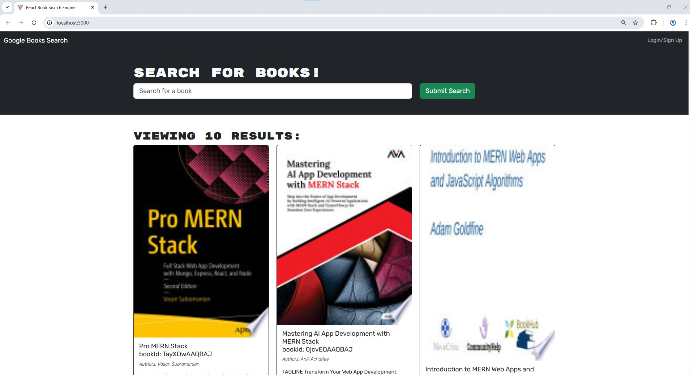
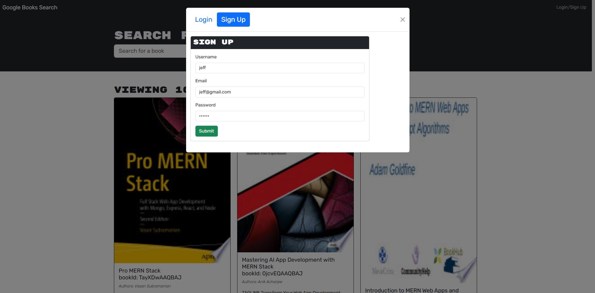
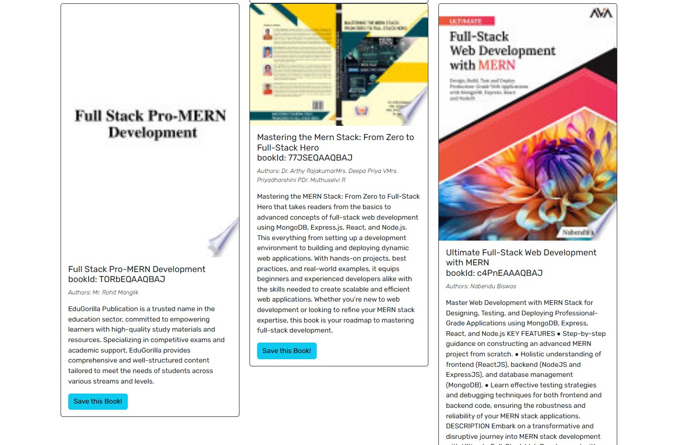
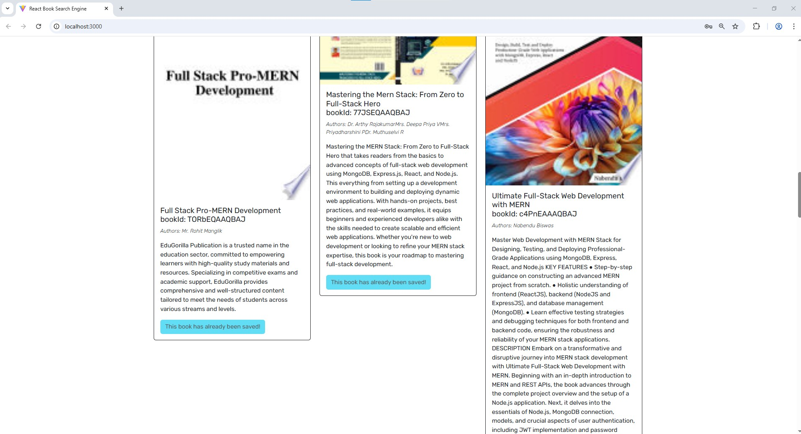
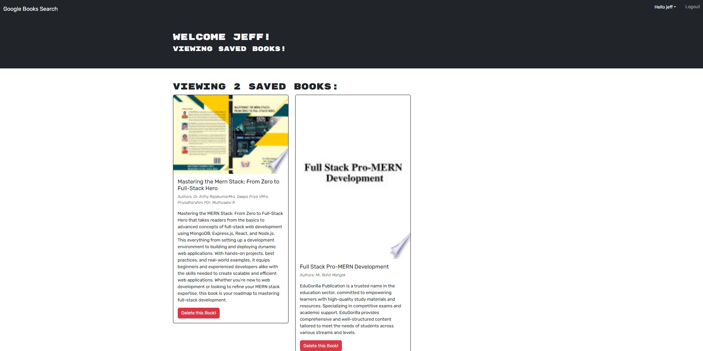
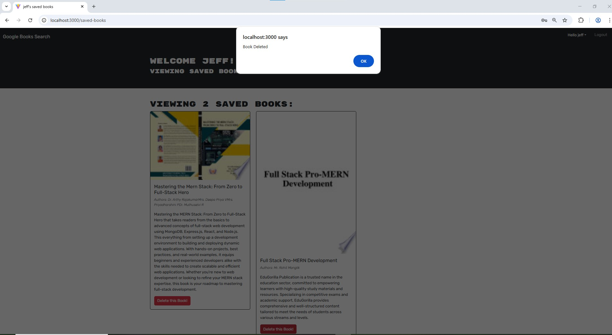

# Book Search Engine

## Table of Contents

 * [Description](#description)

 * [Installation](#installation)

 * [Screenshots](#screenshots)

 * [Contributing](#contributing)

 * [Credits](#credits)

 * [Tests](#tests)

 * [License](#license)

 * [Questions](#questions)

## Description

Welcome to the book search engine! This web tool allows avid readers to search for and save books that they're interested in - whether they have already read the book or are looking to pick it up on their next stop to the bookstore.

When searching for a book, users will be presented with information for each book including the title, list of authors, description, image, and a link to view more details on the Google Books website.

This webtool was built using Apollo Server and utilizes the Google Books API and GraphQL API. This app was also built using the MERN stack - with React front end, MongoDB database, and Node.js/ Express.js server and API.

## Installation

1. Clone the repo:

2. Open in VS Code. If you do not have VS code you must install it.

3. Using the terminal, install node.js v16. If you have homebrew, the command should look like the following (brew install node@16), however this may vary and the documentation should be consulted.

4. Once node.js v16 is installed, in the terminal, utilize the command npm init -y to initialize and create a package.json where project files will be stored.

5. Next, use the terminal to run the command npm i to install the dependencies associated with this application (developers may need to install dependencies directly from the command line).

6. Next, in the terminal, run the command "npm run develop2"

## Screenshots
 
 
 

## Contributing

Contributors:  

- [Khoi Phan](https://github.com/khoiphan-9194)

## Credits

External Sources:  
- [MongoDB](https://www.mongodb.com/)  
- [Mongoose](https://www.npmjs.com/package/mongoose)  
- [Express.js](https://www.npmjs.com/package/express)  
- [React.js](https://react.dev/)  
- [Node.js](https://nodejs.org/en)  
- [bcrypt](https://www.npmjs.com/package/bcrypt)  
- [jsonwebtoken](https://www.npmjs.com/package/jsonwebtoken)  
- [jwt-decode](https://www.npmjs.com/package/jwt-decode)  
- [dotenv](https://www.npmjs.com/package/dotenv)  
- [Bootstrap](https://getbootstrap.com/)  
- [GraphQL](https://graphql.org/)  
- [Apollo](https://www.apollographql.com/)  

This project requires the following npm package dependencies for the back-end server, which are included in the server/package.json file.

    @apollo/server
    apollo-server-express
    bcrypt
    express
    graphql
    jsonwebtoken
    mongoose

Thie project requires the following npm package dependencies for the front-end client, which are included in the client/package.json file.

    @apollo/client
    bootstrap
    graphql
    graphql-tag
    jwt-decode
    react
    react-bootstrap
    react-dom
    react-router-dom

## Tests

N/A

## License

SVG Logo Maker © is licensed under the ISC license.  

For more information regarding the SVG Logo Maker's license, please visit: 
https://opensource.org/licenses/MIT

## Questions?
  
### Github:[khoiphan-9194](https://github.com/khoiphan-9194)
  
### Reach Me Via Email: phanminhkhoi91@gmail.com

Thanks for viewing!

